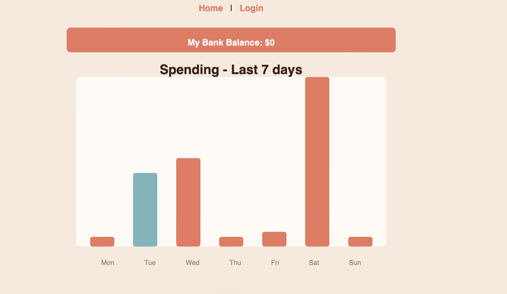
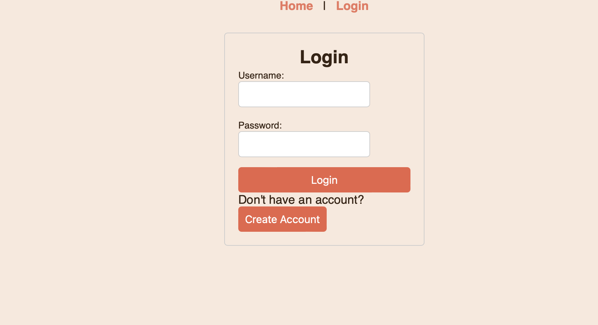
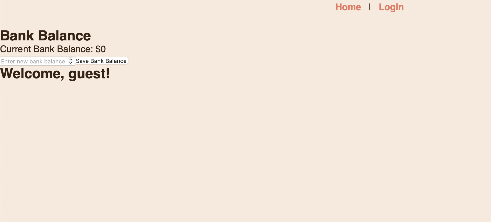
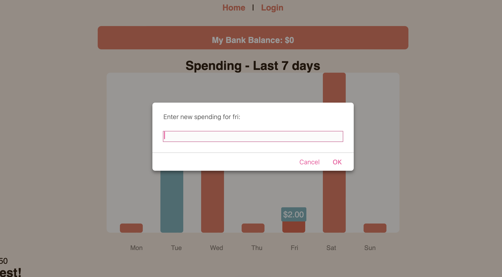
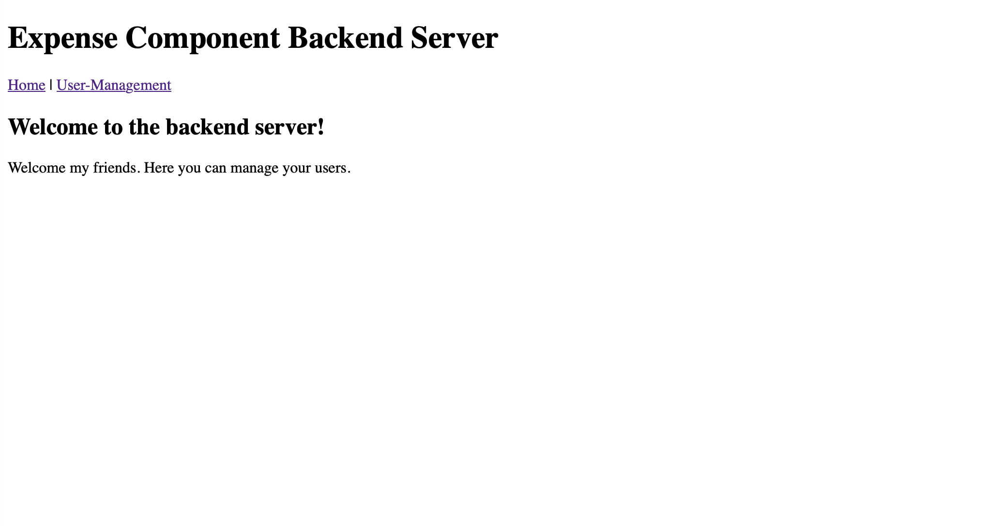
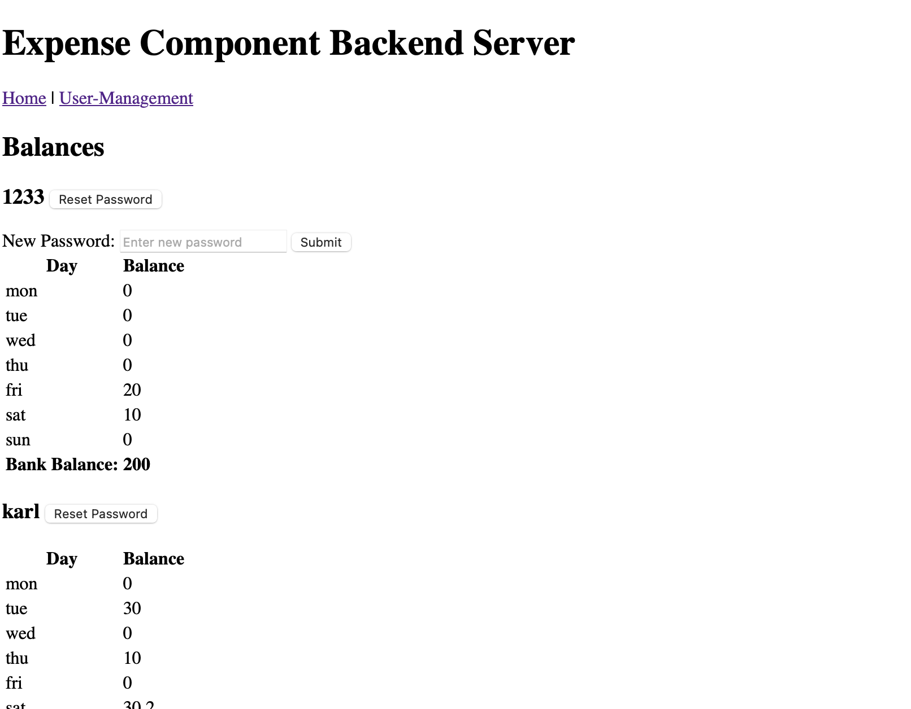

# Frontend Mentor - Expenses chart component

Welcome to my Frontend Mentor Expenses chart final project! Here you will find a full stack web component for an expense keeping chart with a fully functional backend and frontend. This project utilizes the React.JS web building toolbelt for the frontend and node's Express.js framework for the backend. Let us begin our tour with the frontend in all its janky glory. You may visit here: https://frontend-livid-kappa-49.vercel.app

You may notice you are logged in as guest. You can register your own account and have your own data! Simply navigate to the login page via the aboe nav bar. 

You have access to a lovely tool where you can record your bank balance. Sadly you will find that you have $0 to your name. Not to worry! You may click on the "My Bank Blance" bar and fill out this unfortunante looking form.

You may also notice that your chart is not very remarkable at the moment. You have not spent a dime according to its graphics. Each graph represents a day of the week(you will notice the current day highlighted in blue). If you were to click one of the bars, a pop up would appear for you to add to your spendings! 

Now you can record your spendings and see it in beautiful CSS form. 

Let's say you forgot your password. Now it is time to tour our beautiful backend server: https://cs341w-final-production.up.railway.app

Not much to look at, but behold the User-Management route before you.

 Let us assume you are an admin and not just some rando that I gave my backend server url to. You now have access to the entire database of users and their balances. There is a handy button to reset a user's password, right at your disposal!
 

Say you want to install this project as your very own. Simply clone this repo and run "npm install" under the Frontend and Backend directories to install the proper node modules. From there, you can start each server by running "npm run dev" and watch it roll! 